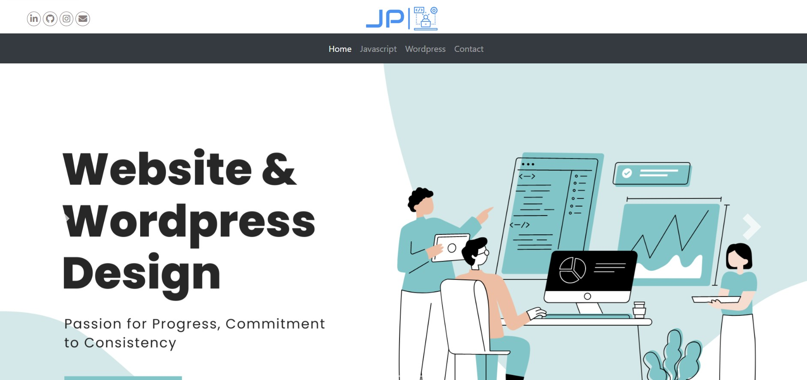
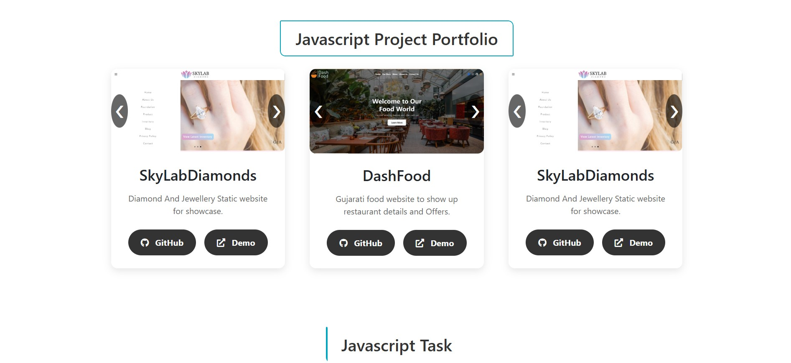
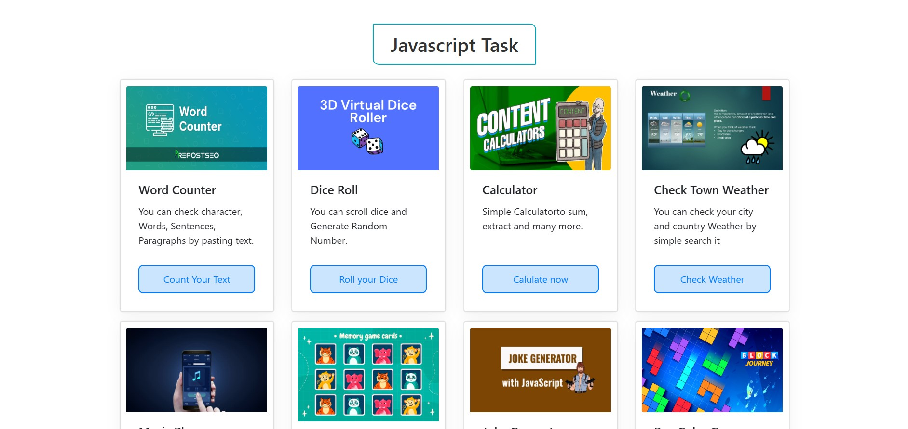
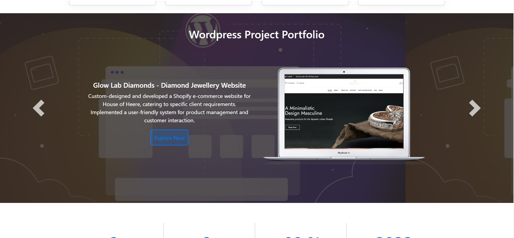
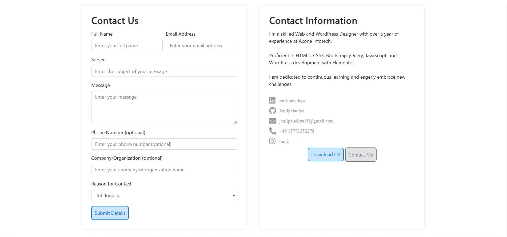
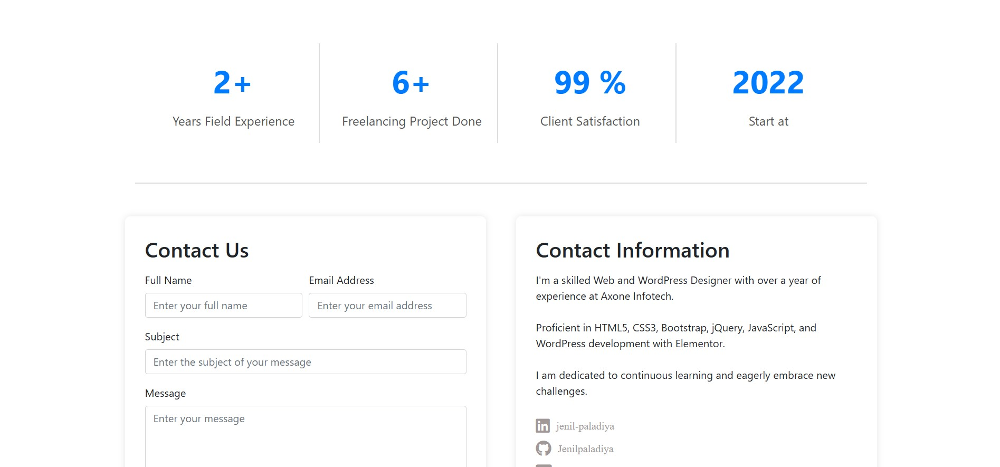
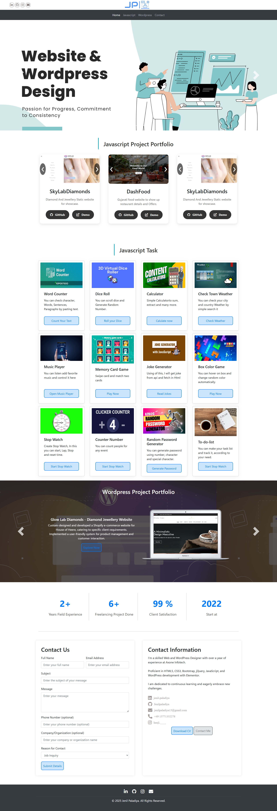

# MyResumeWebsite

MyResumeWebsite is a personal portfolio website showcasing my resume, live projects, and JavaScript tasks completed during my learning path. This project is built using HTML, CSS, JavaScript, and Bootstrap for a responsive and interactive design.

## Live Demo
[MyResumeWebsite Live Project](https://raw.githack.com/Jenilpaladiya/MyResumeWebsite/refs/heads/main/index.html)

## Features
- Fully responsive portfolio design
- Showcases resume details
- Includes live projects and JavaScript tasks
- Built using Bootstrap for improved UI/UX
- Well-structured HTML, CSS, and JavaScript code

## Technologies Used
- HTML5
- CSS3
- JavaScript (ES6)
- Bootstrap

## Demo Images
Here are some preview images of the project:

  
&nbsp;  
  
&nbsp;  
  
&nbsp;  
  
&nbsp;  
  
&nbsp;  
  
&nbsp;  

  
&nbsp;  


## How to Run the Project
1. Clone this repository:
   ```sh
   git clone https://github.com/Jenilpaladiya/MyResumeWebsite.git
   ```
2. Open the `index.html` file in your browser.

## Author
Developed by [Jenil Paladiya](https://github.com/Jenilpaladiya).
